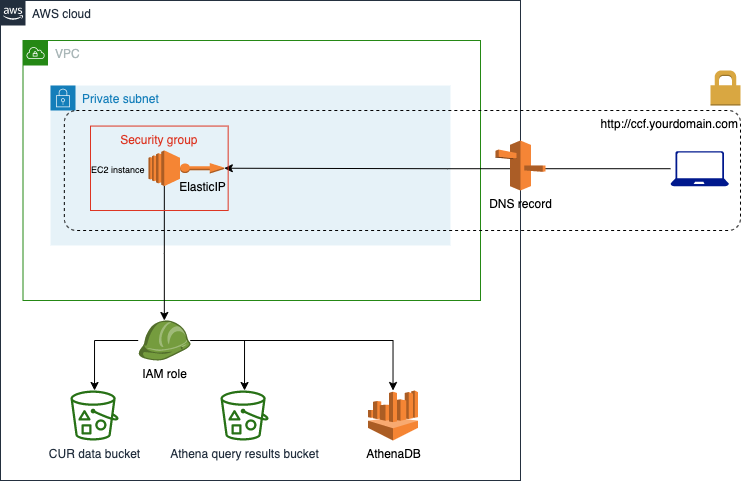

# CCF基础设施设置（AWS / Terraform）
## 概述
该目录包含基本基础架构代码，可使用基本服务（例如EC2，IAM，Route53）在AWS中设置应用程序。目标是拥有一个简单且通用的设置，可以根据每个客户的需求进行配置。

尽管旨在保持通用性，但某些内容可能并不完全适用于您的特定情况，例如您可能没有VPN设置来访问私有计算实例。您应该考虑重新审查架构并相应地调整基础架构。

## 架构
一般架构由以下组件组成：

EC2实例和实例配置文件
EC2安全组
IAM策略和角色
ElasticIP
Route53 DNS记录
S3存储桶（Terraform状态管理）
EC2实例
它是CCF工具将运行的计算资源。它被配置为在私有子网上运行，并使用用户数据进行配置。

用户数据脚本提供在install.sh文件中，其中包含设置应用程序在此云实例中的所有必要步骤。确保您用适当的值替换install.sh文件中的每个占位符。这些值与您将用于为客户端和API配置.env文件的值完全相同。了解更多。

## EC2安全组
它允许向运行在EC2实例中的CCF应用程序传输流量。因此，它在适当的端口上指定一个入口规则。如果您希望应用程序在不同的端口上运行，请确保还更改了install.sh以在PORT变量中反映该端口。

## IAM策略和角色
它们定义访问CCF应用程序所需的AWS服务的权限（Athena、Glue、Cost Explorer和S3）。

## Elastic IP
我们创建一个ElasticIP，将其附加到EC2实例上。此EIP稍后将与DNS记录关联。

## Route53 DNS记录
在私有/公共托管区域中的DNS记录，用于将HOST名称映射到EIP私有IP（实例IP），从而允许实现内部访问。

## S3存储桶
需要进行Terraform状态的远程状态管理

## 图表

## 先决条件
Terraform >= 0.14.9（提示：使用[tfenv]（https://github.com/tfutils/tfenv）来管理多个Terraform版本）
## 如何使用（基本逐步指南）
确保您已创建了用于远程Terraform状态文件的S3存储桶。
转到“variables.tf”并替换所有适用于您的情况的占位符，例如“YOUR-DEFAULT-AWS-REGION”，“YOUR-KEY-PAIR”。如果变量不适用于您的情况，请删除它以保持一致性，例如“YOUR-VPN-SECURITY-GROUP-ID”。
对于文件“terraform.tf”，“provider.tf”，“dns.tf”和“data.tf”，重复步骤2。
转到“install.sh”并替换与您为客户端和API配置环境变量值相关的所有占位符。如果为应用程序配置DNS记录，则还要确保填写HOST和PORT变量。如果不需要，请删除它们。
更改目录以进入terraform目录，并运行“terraform init”。
运行“terraform fmt”。
运行“terraform validate”并确保配置有效
对云供应商运行“terraform plan”和“terraform apply”
## 调试
为了确定“install.sh”脚本是否成功，您可以使用在“key_name”变量中指定的密钥对SSH到实例（或通过AWS控制台连接），并使用以下命令跟踪初始化日志：

$ sudo su
$ tail -f /var/log/cloud-init-output.log 
## 其他注意事项
您可能无法直接将Terraform基础架构应用于云计算提供商。这也已经被PR-based系统（如Atlantis）测试过，但可能仍需要您做出一些微调。

整体架构可能不适合您的需求，例如您可能希望应用程序在Internet facing计算实例上运行，或者您可能不希望为其设置域名等。我们理解存在多个上下文特定的需求，您可以使用此解决方案作为基础来解决这些需求。